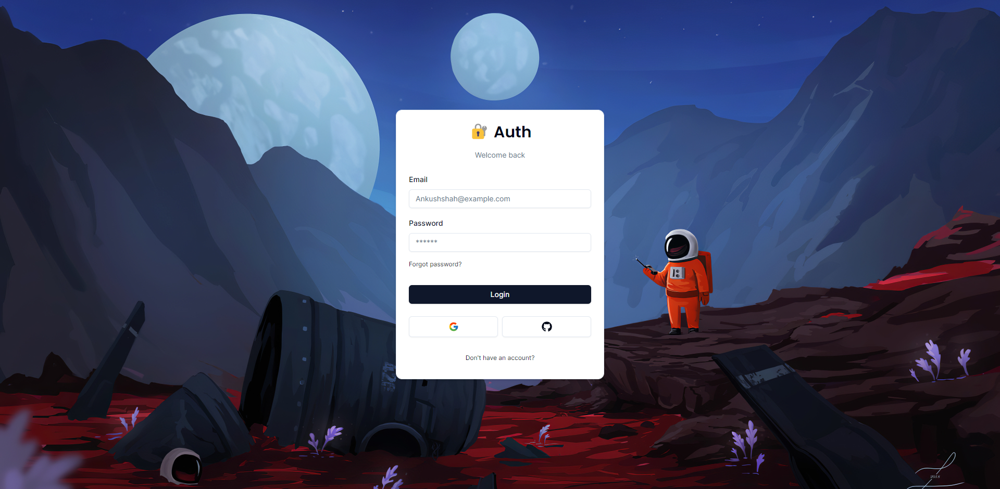

### Go-Verify

Replicates Clerk, a widely used authentication and user management tool. It enables users to securely signup & login, manage their accounts, and access advanced authentication features such as multi-factor authentication, social logins, session management, and more, ensuring a seamless and secure user experience.

### Preview



### <a name="table">Table of Contents</a>

1. [Tech Stack](#tech-stack)
2. [Features](#features)
3. [Getting Started](#getting-started)
4. [Feedback](#feedback)
5. [Contributors](#contributors)

### <a name="tech-stack">Tech Stack</a>

- Next.js
- React.js
- HTML5
- Prisma
- NPX
- CSS3
- Typescript
- Neon - PostgreSQL
- Next Auth
- Resend
- O Auth - Github & Google
- Neon
- Node.js
- NPM
- Tailwind CSS

### <a name="features">Features</a>

-  **Next-auth v5 (Auth.js)**
-  **Next.js 14 with server actions**
-  **Credentials Provider**
-  **OAuth Provider (Social login with Google & GitHub)**
-  **Forgot password functionality**
-  **Email verification**
-  **Two factor verification**
-  **User roles (Admin & User)**
-  **Login component (Opens in redirect or modal)**
-  **Register component**
-  **Forgot password component**
-  **Verification component**
-  **Error component**
-  **Login button**
-  **Logout button**
-  **Role Gate**
-  **Exploring next.js middleware**
-  **Extending & Exploring next-auth session**
-  **Exploring next-auth callbacks**
-  **useCurrentUser hook**
-  **useRole hook**
-  **currentUser utility**
-  **currentRole utility**
-  **Example with server component**
-  **Example with client component**
-  **Render content for admins using RoleGate component**
-  **Protect API Routes for admins only**
-  **Protect Server Actions for admins only**
-  **Change email with new verification in Settings page**
-  **Change password with old password confirmation in Settings page**
-  **Enable/disable two-factor auth in Settings page**
-  **Change user role in Settings page (for development purposes only)**

### Prerequisites

- [Git](https://git-scm.com/)
- [Node.js](https://nodejs.org/en)
- [npm](https://www.npmjs.com/) (Node Package Manager)

### Cloning

1. **Cloning:** 

    Run the following command in your terminal or command prompt to clone the repository to your local machine:

    ```bash
    git clone https://github.com/theankushshah/oibsip_taskno.git
    ```

2. **Navigate to the Directory:** 
    
    Once cloned, navigate into the project directory using the `cd` command:

    ```bash
    cd oibsip_taskno
    ```

### Download

1. **Download ZIP Code folder:** 

    Unzip the folder in your machine.

2. **Navigate to the Downloaded Directory:** 

    Open your code editor and open the unzipped folder in it then:

    ```bash
    cd /path/to/downloaded/folder
    ```

### Cloning & Download

1. **Dependencies Installation:**

    ```bash
    npm install
    ```

2. **Environment Variables & Database Setup:** 

    Create a new file named `.env` in the root of your project and add the following content:

    ```env
    DATABASE_URL=
    DIRECT_URL=

    AUTH_SECRET="secret"

    GITHUB_CLIENT_ID=
    GITHUB_CLIENT_SECRET=

    GOOGLE_CLIENT_ID=
    GOOGLE_CLIENT_SECRET=

    RESEND_API_KEY=
    ```

    Replace the placeholder values with your actual O Auth, Resend & Database credentials. You can obtain these credentials by signing up on the [Google cloud website](https://console.cloud.google.com), [Github website](https://github.com/settings/developers), [Resend website](https://resend.com) and [Neon website](https://www.neon.tech)

    If you're wondering why can't we use our custom email for deep email interactions is beacuse of the tech we used in the project "Resend" It is a software which allows you to send emails on any cutsom email only if you connect a domain with it otherwise a Big NO, So as we had used it without the domain So, we can only send emails i mean can do deep email interactions with the email we had registered on Resend which is - codetesterteam@gmail.com

3. **Database Run:**

    Run the following command to run the database:

    ```bash
    npx prisma generate
    npx prisma db push
    npx prisma studio
    ```

    Open the ORM in your browser to view the database.

4. **Running:**

    ```bash
    npm run dev
    ```

    Open [http://localhost:3000](http://localhost:3000) in your browser to view the project.

5. **Start Coding:** 

    Feel free to edit the code according to your requirements. 

6. **Testing**

    ```bash
    npm test
    ```

7. **Build for Production**

    ```bash
    npm run build
    ```

### Github

1. **Initialize a New Git Repository:**

    ```bash
    git init
    ```

2. **Stage and Commit the Code:**

    ```bash
    git add .
    git commit -m "Initial commit"
    ```

3. **Create a New Repository on GitHub:**

    Do not initialize the new repository with a README, .gitignore, or license.

4. **Link Local Repository to GitHub:**

    ```bash
    git remote add origin https://github.com/username/new-repo.git
    ```

    Replace https://github.com/username/new-repo.git with your actual repository URL.

5. **Push Code to GitHub:**

    ```bash
    git branch -m main
    git pull origin main
    git push -u origin main
    ```

6. **Deployment:** 
    
    Deploy the application to your preferred hosting platform to make it accessible online.

### Forking

1. **Forking:** 

    Run the following command in your terminal or command prompt to fork the repository to your local machine:

    ```bash
    git clone https://github.com/your-username/oibsip_taskno.git
    ```

2. **Navigate to the Directory:** 

    Once cloned, navigate into the project directory using the `cd` command:

    ```bash
    cd oibsip_taskno
    ```

3. **Start Coding:** 

    Make the additions & desired changes to the code.

4. **Commit & Push Your Changes to Your Fork:** 

    Once cloned, navigate into the project directory using the `cd` command:

    ```bash
    git add .
    git commit -m ""
    git pull origin main
    git push -u origin main
    ```

5. **Create a Pull Request:**

- Go to your forked repository on GitHub
- Click the "Compare & pull request" button.
- Review your changes and write a clear description of your contribution.
- Click "Create pull request"

    **I will review your pull request and decide whether to merge your changes into my repository or not**

### <a name="feedback">Feedback</a>

You might encounter some bugs while using this app. You are more than welcome to contribute. Just submit changes via pull request and I will review them before merging. Make sure you follow community guidelines.

### <a name="contributors">Contributors & Main</a>

- Ankush Shah (ankushsahvlogs@gmail.com)
- Haven Futures (support@havenfutures.com) (Main)

Happy coding!